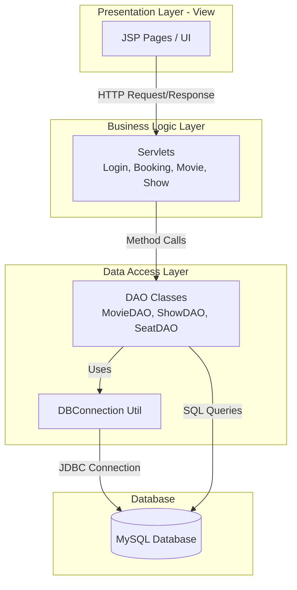

# System Architecture

```mermaid
architecture-beta
    group frontend(internet)[Frontend - View]
    group backend(server)[Backend - Controller]
    group data(database)[Data Layer - Model]

    service jsp(server)[JSP Pages (Client UI)] in frontend
    service servlets(server)[Servlets] in backend
    service daos(server)[DAO Layer] in data
    service db(database)[MySQL Database] in data

    jsp:R --> L:servlets
    servlets:R --> L:daos
    daos:R --> L:db
```

```mermaid
graph TD
    subgraph Frontend [Presentation Layer - View]
        JSP[JSP Pages / UI]
    end

    subgraph Controller [Business Logic Layer]
        Servlets[Servlets<br/>Login, Booking, Movie, Show]
    end

    subgraph Model [Data Access Layer]
        DAOs[DAO Classes<br/>MovieDAO, ShowDAO, SeatDAO]
        Util[DBConnection Util]
    end

    subgraph Database [Database]
        MySQL[(MySQL Database)]
    end

    JSP -- HTTP Request/Response --> Servlets
    Servlets -- Method Calls --> DAOs
    DAOs -- Uses --> Util
    Util -- JDBC Connection --> MySQL
    DAOs -- SQL Queries --> MySQL
```
