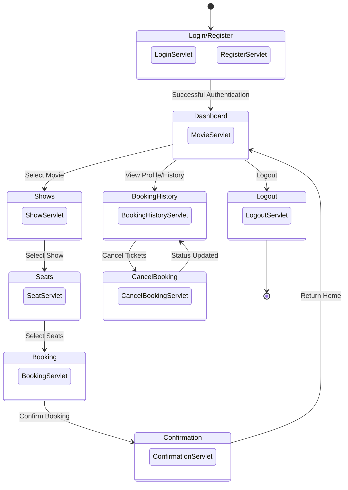
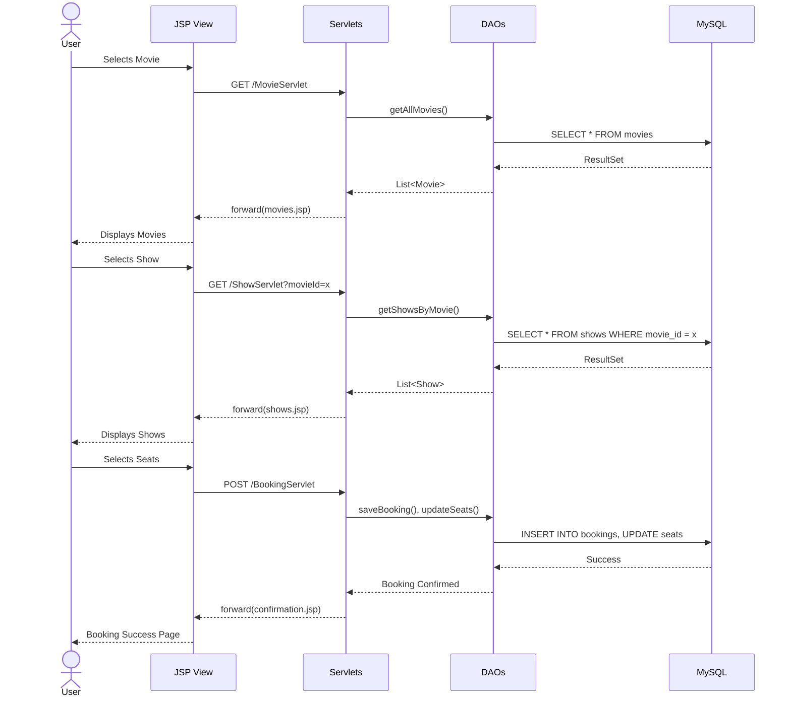

# Application Workflow Diagram

```mermaid
stateDiagram-v2
    [*] --> Login/Register
    
    state Login/Register {
        LoginServlet
        RegisterServlet
    }
    
    Login/Register --> Dashboard : Successful Authentication
    
    state Dashboard {
        MovieServlet
    }
    
    Dashboard --> Shows : Select Movie
    
    state Shows {
        ShowServlet
    }
    
    Shows --> Seats : Select Show
    
    state Seats {
        SeatServlet
    }
    
    Seats --> Booking : Select Seats
    
    state Booking {
        BookingServlet
    }
    
    Booking --> Confirmation : Confirm Booking
    
    state Confirmation {
        ConfirmationServlet
    }
    
    Confirmation --> Dashboard : Return Home
    
    Dashboard --> BookingHistory : View Profile/History
    
    state BookingHistory {
        BookingHistoryServlet
    }
    
    BookingHistory --> CancelBooking : Cancel Tickets
    
    state CancelBooking {
        CancelBookingServlet
    }
    
    CancelBooking --> BookingHistory : Status Updated
    
    Dashboard --> Logout : Logout
    
    state Logout {
        LogoutServlet
    }
    
    Logout --> [*]
```

```mermaid
sequenceDiagram
    actor User
    participant Browser as JSP View
    participant Ctrl as Servlets
    participant DAO as DAOs
    participant DB as MySQL
    
    User->>Browser: Selects Movie
    Browser->>Ctrl: GET /MovieServlet
    Ctrl->>DAO: getAllMovies()
    DAO->>DB: SELECT * FROM movies
    DB-->>DAO: ResultSet
    DAO-->>Ctrl: List<Movie>
    Ctrl-->>Browser: forward(movies.jsp)
    Browser-->>User: Displays Movies
    
    User->>Browser: Selects Show
    Browser->>Ctrl: GET /ShowServlet?movieId=x
    Ctrl->>DAO: getShowsByMovie()
    DAO->>DB: SELECT * FROM shows WHERE movie_id = x
    DB-->>DAO: ResultSet
    DAO-->>Ctrl: List<Show>
    Ctrl-->>Browser: forward(shows.jsp)
    Browser-->>User: Displays Shows
    
    User->>Browser: Selects Seats
    Browser->>Ctrl: POST /BookingServlet
    Ctrl->>DAO: saveBooking(), updateSeats()
    DAO->>DB: INSERT INTO bookings, UPDATE seats
    DB-->>DAO: Success
    DAO-->>Ctrl: Booking Confirmed
    Ctrl-->>Browser: forward(confirmation.jsp)
    Browser-->>User: Booking Success Page
```
